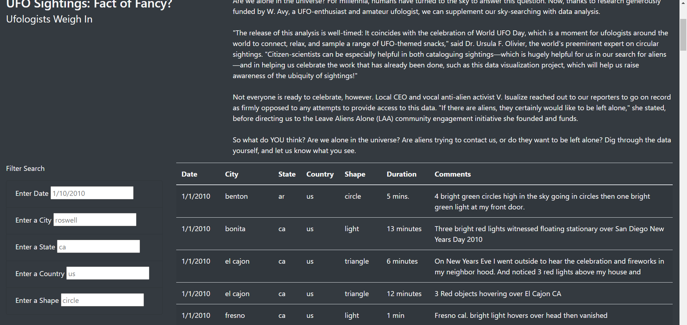
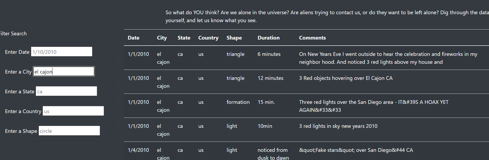
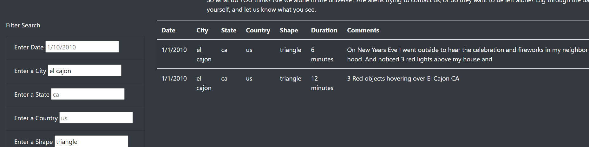

# Overview

This project was done in an effort to create a repository for easy filtration of UFO sitings over the years. Data regarding each UFO siting, including the country wherein the siting occured, the state, the city and the shape of the object, were all read into a database from which an HTML page was created to house the information.

The ask for this project was that filters be created within the HTML page that would be able to filter the data on the page for each of the above criterium (country, state, city and shape) and have the page respond accordingly. 

# Results

We can see in the below screenshot a picture of the page in question with the filter bars being included on the left and the data being housed to the right of the bars:

Then, when filter information is added we can see that the information on the right responds accordingly to the filter information:

Multiple filter criteria can be entered and the page will respond according to each of the different filters:

# Summary 

One of the primary drawbacks of this webpage is that the data being hosted is provided by third parties and as such the cleanliness of the data is at the mercy of each of the parties. For example, in the comments section there is a wide variety of types of comments with some providing much more insight than others. However due to a lack of structure for how the users can submit this information much of the comments left provide no additonal insight as to the phenomenon.

In order to impove this I would have included additonal information on the submission form stipulating how users should provide comments such as only comments regarding the movement behavior or appearance of the object should be allowed.
